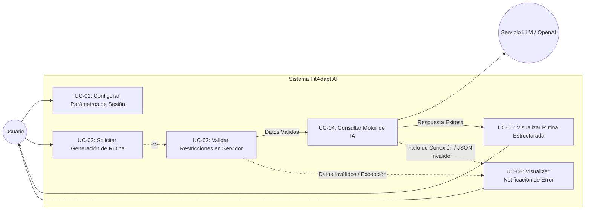
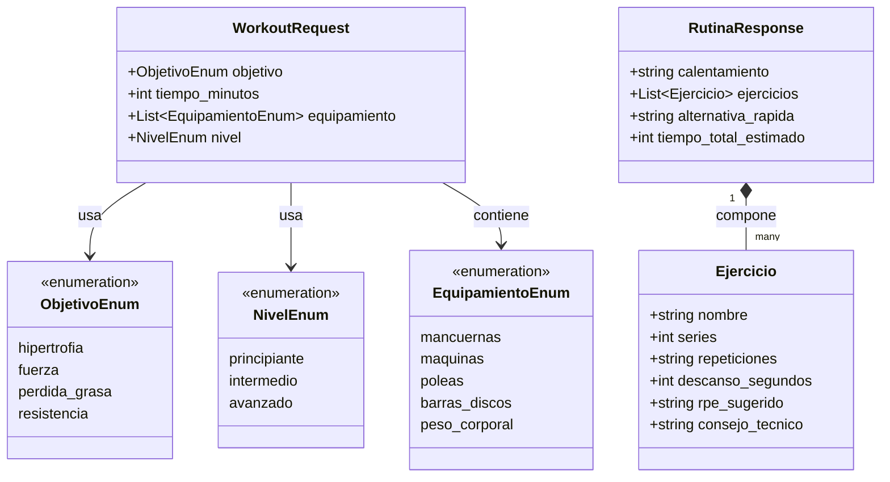
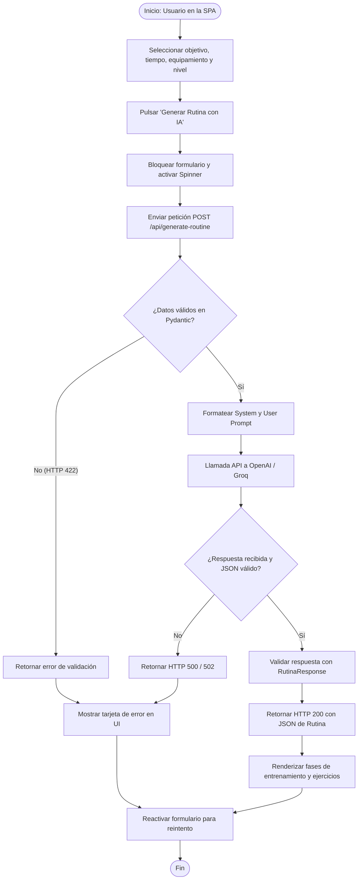
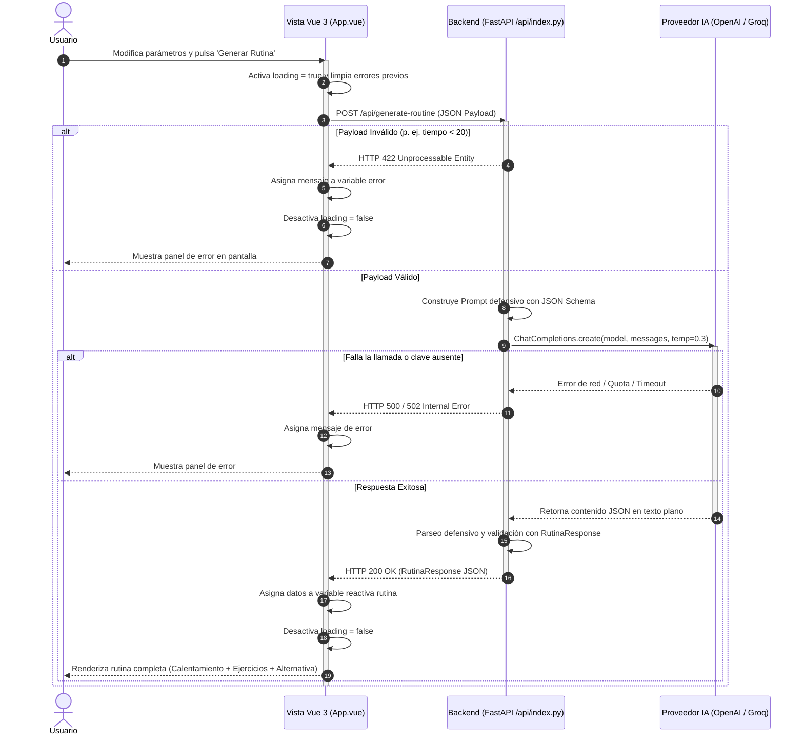
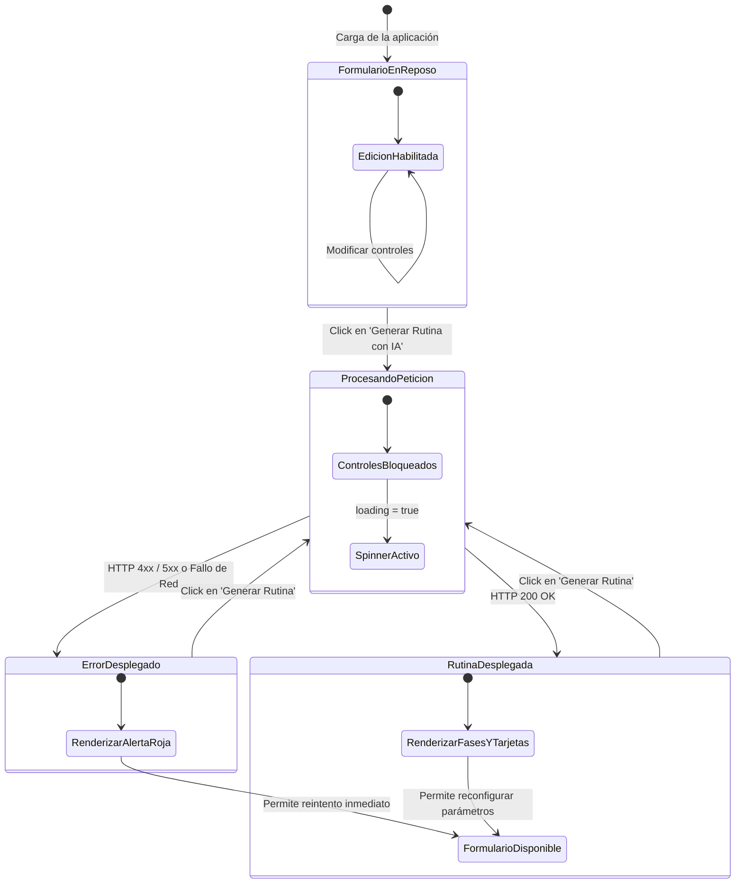

# PARTE 1: Especificación Técnica, Diseño y Guía Pedagógica

---

## 1. Descripción Detallada del Proyecto

**FitAdapt AI** es una aplicación web de pantalla única (*Single Page Application* o SPA) enfocada en el acondicionamiento físico personalizado mediante Inteligencia Artificial. Su propósito pedagógico es instruir en el diseño y despliegue de una arquitectura de software *full-stack serverless* que combina tipado estricto en cliente y servidor, ingeniería de prompts estructurados y control de estados reactivos.

### 1.1. ¿Cómo funciona la aplicación?

El flujo operativo del sistema consta de cuatro etapas sincronizadas:

1. **Captura Paramétrica en el Cliente:**  
   El usuario interactúa con un panel de control unificado donde configura exactamente cuatro variables de entrenamiento:
   * **Objetivo de acondicionamiento:** Foco fisiológico de la sesión (`hipertrofia`, `fuerza`, `perdida_grasa`, `resistencia`).
   * **Tiempo disponible:** Selector numérico continuo (slider) restringido entre 20 y 75 minutos (intervalos de 5 minutos).
   * **Equipamiento accesible:** Matriz de selección múltiple (píldoras interactivas) con validación activa para garantizar al menos un elemento elegido (`mancuernas`, `maquinas`, `poleas`, `barras_discos`, `peso_corporal`).
   * **Nivel de experiencia:** Autoevaluación de competencia técnica del usuario (`principiante`, `intermedio`, `avanzado`).

2. **Validación y Despacho:**  
   Al enviar el formulario, el cliente en **Vue 3 + TypeScript** verifica la integridad local del estado y bloquea la interfaz en modo asíncrono (*loading state* con deshabilitación de botones y activación de spinners). Emite una petición `POST /api/generate-routine` serializada en JSON.

3. **Intermediación Segura y Razonamiento (Backend FastAPI):**  
   La función *serverless* en Python recibe el paquete de datos y lo somete a las restricciones de validación de **Pydantic v2**:
   * Si los datos son inconsistentes (p. ej., tiempo manipulado a 10 minutos), el servidor rechaza la solicitud de inmediato con código HTTP 422, sin contactar con la IA.
   * Si los datos son válidos, el servicio construye un *prompt* blindado que contiene un rol de sistema estricto (*System Prompt*) y los datos delimitados del usuario (*User Prompt*), exigiendo una respuesta exclusiva en formato JSON estructurado.
   * Se ejecuta la consulta hacia el proveedor de IA utilizando la API Key alojada de forma segura en las variables de entorno del servidor.

4. **Consumo y Renderizado Reactivo:**  
   FastAPI analiza defensivamente la respuesta de la IA, comprueba su conformidad con el modelo `RutinaResponse` y la transfiere al cliente con código HTTP 200. Vue 3 procesa la respuesta reactiva y renderiza de inmediato el bloque de entrenamiento segmentado: activación neuromuscular previa, ejercicios principales con métricas de esfuerzo (RPE, series, repeticiones y descansos), consejos de seguridad biomecánica y alternativas de sustitución en caso de congestión en el gimnasio.

---

### 1.2. Ejemplo Práctico de Uso de Extremo a Extremo

* **Escenario:** Carlos dispone únicamente del descanso de mediodía de su trabajo para acudir a un gimnasio convencional. No quiere perder tiempo pensando qué hacer ni esperando máquinas ocupadas.
* **Datos introducidos por Carlos en la UI:**
  * *Objetivo:* `hipertrofia` (Ganar masa muscular).
  * *Tiempo:* `35 minutos`.
  * *Equipamiento seleccionado:* `mancuernas`, `peso_corporal`.
  * *Nivel:* `principiante`.
* **Payload HTTP transmitido hacia FastAPI (`POST /api/generate-routine`):**
  ```json
  {
    "objetivo": "hipertrofia",
    "tiempo_minutos": 35,
    "equipamiento": ["mancuernas", "peso_corporal"],
    "nivel": "principiante"
  }
  ```
* **Respuesta JSON estructurada devuelta por el Backend:**
  ```json
  {
    "calentamiento": "3 minutos de rotaciones articulares (hombros y caderas) seguidos de 2 minutos de flexiones inclinadas suaves y sentadillas al aire.",
    "ejercicios": [
      {
        "nombre": "Sentadilla Goblet con Mancuerna",
        "series": 3,
        "repeticiones": "10-12",
        "descanso_segundos": 60,
        "rpe_sugerido": "RPE 7",
        "consejo_tecnico": "Mantén los talones completamente apoyados y el pecho elevado sosteniendo la mancuerna vertical contra el esternón."
      },
      {
        "nombre": "Flexiones en suelo con manos elevadas o rodillas",
        "series": 3,
        "repeticiones": "8-10",
        "descanso_segundos": 60,
        "rpe_sugerido": "RPE 7.5",
        "consejo_tecnico": "Alinea cuello, cadera y talones; no dejes caer la zona lumbar al descender."
      },
      {
        "nombre": "Remo con mancuerna a una mano apoyado en banco",
        "series": 3,
        "repeticiones": "10-12",
        "descanso_segundos": 60,
        "rpe_sugerido": "RPE 7",
        "consejo_tecnico": "Tira dirigiendo el codo hacia la cadera sin rotar bruscamente el tronco."
      }
    ],
    "alternativa_rapida": "Si las mancuernas de tu peso objetivo están ocupadas, realiza Zancadas dinámicas con peso corporal duplicando el número de repeticiones.",
    "tiempo_total_estimado": 35
  }
  ```
* **Renderizado en pantalla:** La interfaz oculta el estado de carga y despliega de inmediato las tarjetas visuales de entrenamiento, permitiendo al usuario ejecutar su sesión paso a paso con las pautas de descanso y ejecución técnica.

---

## 2. Objetivos de Aprendizaje

1. **Tipado Estricto de Extremo a Extremo (End-to-End Type Safety):** Diseñar interfaces en TypeScript coherentes con los esquemas Pydantic del backend para asegurar la homogeneidad del contrato de datos.
2. **Reactividad Moderna con Vue 3:** Utilizar la sintaxis `<script setup lang="ts">`, referencias reactivas (`ref`), vinculación bidireccional (`v-model`), renderizado condicional (`v-if`, `v-else`) y directivas de listas (`v-for`).
3. **Diseño Modular con Tailwind CSS:** Maquetar una interfaz *mobile-first* accesible y con estados interactivos (foco, deshabilitación, alertas, paleta oscura temática).
4. **Seguridad e Inyecciones en LLMs:** Diseñar un *System Prompt* defensivo con validaciones restrictivas previas en Pydantic que mitiguen ataques de manipulación de instrucciones (*Prompt Injection*).
5. **Aislamiento de Secretos:** Configurar y resguardar variables de entorno en el servidor (`OPENAI_API_KEY`), garantizando que ninguna clave privada viaje al navegador del cliente.
6. **Pruebas Automatizadas Rigurosas:**
   * Pruebas de integración en FastAPI con **Pytest**, emulando peticiones con `TestClient` y aislando la IA mediante *mocks* para evitar consumo de tokens.
   * Pruebas unitarias y de integración de componentes en **Vitest** con `@vue/test-utils` sobre un entorno emulado con `jsdom`.
7. **Arquitectura Monorepositorio Serverless en Vercel:** Integrar un cliente Vite compilado a estáticos junto a endpoints dinámicos de Python ejecutados como Serverless Functions bajo el mismo origen.

---

## 3. Requisitos y Stack Tecnológico

### 3.1. Requisitos del Entorno
* **Node.js:** Versión 18.x o 20.x LTS.
* **Python:** Versión 3.10 o 3.11 con `pip` y soporte de entornos virtuales (`venv`).
* **Git:** Para control de versiones y despliegue automatizado.
* **Proveedor de IA:** Clave de API activa de OpenAI (`sk-...`) o Groq Cloud (`gsk-...`).
* **Vercel CLI / Cuenta Vercel:** Cuenta activa para despliegue en producción.

### 3.2. Stack Tecnológico

| Capa / Rol | Tecnología | Versión / Utilidad |
| :--- | :--- | :--- |
| **Lenguaje Frontend** | **TypeScript** | v5.x (Tipado estricto en cliente) |
| **Framework UI** | **Vue.js 3** | Composition API con `<script setup lang="ts">` |
| **Herramienta de Build** | **Vite** | v5.x con `@vitejs/plugin-vue` |
| **Framework de Estilos** | **Tailwind CSS** | v3.4 con Autoprefixer y PostCSS |
| **Iconografía** | **lucide-vue-next** | Iconos vectoriales accesibles |
| **Testing Frontend** | **Vitest + @vue/test-utils** | Pruebas de integración de componentes UI |
| **Backend Framework** | **FastAPI** | Framework web ASGI de alto rendimiento |
| **Validación de Datos** | **Pydantic** | v2.x (Validación estructural y parseo de tipos) |
| **SDK de IA** | **OpenAI Python SDK** | v1.x (Conexión compatible con OpenAI y Groq) |
| **Testing Backend** | **Pytest + HTTPX** | Pruebas unitarias de endpoints con soporte asíncrono |
| **Hosting y CI/CD** | **Vercel** | Infraestructura monorepositorio con Serverless Runtimes |

---

## 4. Estructura del Proyecto

```text
fitadapt-vue-ts/
├── api/
│   ├── __init__.py            # Marca el directorio como módulo Python para Vercel
│   ├── index.py               # Servidor FastAPI, endpoints, esquemas Pydantic y llamadas LLM
│   └── test_api.py            # Suite de pruebas Pytest con mocks de la IA
├── public/
│   └── favicon.ico            # Favicon del sistema
├── src/
│   ├── types/
│   │   └── workout.ts         # Definición de tipos e interfaces TypeScript compartidas
│   ├── App.vue                # Componente principal SPA (formulario y rutina)
│   ├── env.d.ts               # Declaraciones de tipado para Vite y módulos Vue
│   ├── main.ts                # Inicialización y montaje del árbol Vue
│   └── style.css              # Directivas base y utilidades de Tailwind CSS
├── tests/
│   └── App.spec.ts            # Suite de pruebas frontend con Vitest y @vue/test-utils
├── .env.example               # Plantilla de variables de entorno requeridas
├── .gitignore                 # Exclusión de artefactos de compilación, venv y secretos
├── index.html                 # Punto de entrada HTML5
├── package.json               # Dependencias de npm y scripts de ejecución
├── postcss.config.js          # Pipeline de PostCSS para Tailwind
├── requirements.txt           # Dependencias de Python detectadas por el build de Vercel
├── tailwind.config.js         # Configuración del motor de purgado de Tailwind CSS
├── tsconfig.json              # Configuración de compilación TypeScript para la aplicación
├── tsconfig.node.json         # Configuración TypeScript específica para la configuración de Vite
├── vercel.json                # Reglas de enrutamiento y reescritura hacia funciones Serverless
└── vite.config.ts             # Configuración de Vite, proxy de desarrollo y runner de Vitest
```

---

## 5. Requisitos Funcionales y No Funcionales

### 5.1. Requisitos Funcionales (RF)

* **RF-01 (Selección Paramétrica Restringida):**
  * **RF-01.1:** El usuario debe seleccionar un único objetivo deportivo de una lista predefinida: `hipertrofia`, `fuerza`, `perdida_grasa` o `resistencia`.
  * **RF-01.2:** El usuario debe definir la duración mediante un control deslizante acotado estrictamente entre 20 y 75 minutos, con saltos discretos de 5 minutos.
  * **RF-01.3:** El usuario debe poder alternar la disponibilidad de equipamiento mediante botones conmutables independientes (`mancuernas`, `maquinas`, `poleas`, `barras_discos`, `peso_corporal`). La aplicación debe impedir desmarcar todas las opciones, garantizando al menos un ítem activo.
  * **RF-01.4:** El usuario debe seleccionar su nivel de experiencia entre `principiante`, `intermedio` y `avanzado`.
* **RF-02 (Procesamiento Asíncrono y Estado de Bloqueo):** Al activar el botón de envío, el sistema debe inhabilitar los controles de formulario, activar el estado de carga con un spinner animado e iniciar la llamada HTTP a `/api/generate-routine`.
* **RF-03 (Esquema de Rutina Específico):** La rutina devuelta por el servidor debe contener obligatoriamente:
  * Texto explicativo de activación y movilidad articular.
  * Lista detallada de ejercicios (nombre del movimiento, series, repeticiones, tiempo de descanso en segundos, nivel de RPE y consejo técnico de seguridad).
  * Ejercicio alternativo de sustitución inmediata.
  * Duración total estimada calculada.
* **RF-04 (Presentación Visual de Resultados):** El cliente debe desplegar la rutina estructurada en bloques diferenciados dentro de la misma pantalla, sin navegación externa.
* **RF-05 (Notificación y Recuperación ante Errores):** Si la API responde con un código de error (422, 500, 502) o falla la conexión de red, la interfaz debe mostrar una tarjeta de advertencia visible con el mensaje del servidor y devolver el formulario a un estado interactivo para su reintento.

### 5.2. Requisitos No Funcionales (RNF)

* **RNF-01 (Seguridad - Confinamiento de Secretos):** La clave privada `OPENAI_API_KEY` reside exclusivamente en el entorno de ejecución del servidor. Ningún encabezado ni payload en el navegador debe contener claves privadas.
* **RNF-02 (Seguridad - Defensa contra Manipulación de Prompts):** Los parámetros de usuario están restringidos a enumeraciones y tipos enteros antes de la interpolación del prompt. No existen áreas de texto libre que permitan insertar comandos en lenguaje natural que adulteren las directivas del modelo.
* **RNF-03 (Seguridad - Doble Barrera de Validación):** Toda restricción impuesta en la UI se valida de forma idéntica en el backend mediante Pydantic v2. Cualquier petición adulterada fuera de los rangos válidos es rechazada con un código HTTP 422.
* **RNF-04 (Arquitectura y Cohesión de Red):** La aplicación debe funcionar sin cambios en el código tanto en desarrollo local (usando el proxy de Vite) como en producción sobre Vercel (empleando rewrites en `vercel.json`), operando bajo el mismo origen para evitar problemas de CORS.
* **RNF-05 (Calidad de Código y Tipado):** El proyecto en el frontend debe compilar con cero errores en `vue-tsc --noEmit` bajo las directivas de TypeScript estricto.

---

## 6. Diagramas UML del Sistema

### 6.1. Diagrama de Casos de Uso

El diagrama de casos de uso refleja las interacciones del usuario con la interfaz SPA y la interacción entre el backend y el proveedor externo de IA.



#### Descripción de Casos de Uso:
* **UC-01 (Configurar Parámetros de Sesión):** El usuario ajusta objetivo, tiempo, equipamiento y experiencia en los controles interactivos.
* **UC-02 (Solicitar Generación de Rutina):** El usuario pulsa el botón de acción para enviar los datos hacia el backend.
* **UC-03 (Validar Restricciones en Servidor):** FastAPI intercepta la petición entrante y verifica tipos, rangos y cardinalidades mediante esquemas de Pydantic.
* **UC-04 (Consultar Motor de IA):** El backend construye el prompt del sistema y envía la petición autenticada al servicio LLM (OpenAI o Groq).
* **UC-05 (Visualizar Rutina Estructurada):** El usuario examina en pantalla los ejercicios, series, repeticiones y descansos formateados.
* **UC-06 (Visualizar Notificación de Error):** La aplicación muestra un panel de aviso si ocurre un fallo de validación o un problema en la conexión con la IA.

---

### 6.2. Diagrama de Clases

Representa los modelos de datos compartidos conceptualmente entre el cliente TypeScript y el backend FastAPI/Pydantic.



---

### 6.3. Diagrama de Actividad

Describe el flujo de control, la validación en múltiples niveles y las bifurcaciones operativas durante la generación de una rutina.



---

### 6.4. Diagrama de Secuencia

Ilustra las interacciones temporales y el intercambio de mensajes entre el usuario, el componente Vue, el servidor FastAPI y la API externa de IA.



---

### 6.5. Diagrama de Transición de Estados del Frontend

Representa los estados visuales del componente `App.vue` ante las acciones del usuario y las respuestas de red.



---

## 7. Plan de Fases de Ejecución Paso a Paso

### FASE 1: Inicialización del Proyecto y Entornos de Desarrollo
* **1.1. Andamiaje del Frontend:** Crear el proyecto con Vite y plantilla Vue + TypeScript. Instalar dependencias de producción (`vue`, `lucide-vue-next`) y de desarrollo (`vite`, `@vitejs/plugin-vue`, `typescript`, `vue-tsc`, `tailwindcss`, `postcss`, `autoprefixer`, `vitest`, `@vue/test-utils`, `jsdom`).
* **1.2. Configuración de Tailwind CSS:** Ejecutar `npx tailwindcss init -p` y configurar el barrido de archivos en `tailwind.config.js` para procesar ficheros con extensiones `.vue`, `.ts` y `.html`. Inyectar las directivas `@tailwind` en `src/style.css`.
* **1.3. Enlace de Red Local (Proxy):** Configurar la propiedad `server.proxy` en `vite.config.ts` para desviar todas las llamadas que comiencen por `/api` al puerto local `8000`. Esto permite trabajar en local con rutas idénticas a las que se usarán en Vercel.
* **1.4. Aislamiento del Entorno Python:** Crear un entorno virtual `.venv`, activarlo e instalar mediante `pip`: `fastapi`, `uvicorn`, `pydantic`, `openai`, `pytest`, `httpx` y `python-dotenv`. Volcar las dependencias en `requirements.txt`.

### FASE 2: Desarrollo del Backend Serverless con FastAPI
* **2.1. Modelado de Dominio con Pydantic:** En `api/index.py`, definir las clases enumeradas `ObjetivoEnum`, `NivelEnum` y `EquipamientoEnum`. Crear el modelo `WorkoutRequest` implementando las validaciones de rango numérico (`ge=20, le=75`) y tamaño de lista (`min_length=1`).
* **2.2. Modelos de Salida Estructurados:** Definir las clases `Ejercicio` y `RutinaResponse` con los tipos estrictos correspondientes a cada campo (series como entero, repeticiones como cadena para permitir rangos tipo "8-10", descansos como enteros en segundos).
* **2.3. Factoría de Conexión y Gestión de Secretos:** Implementar la función `get_openai_client()` para leer `OPENAI_API_KEY` del entorno y admitir de forma transparente la variable opcional `OPENAI_BASE_URL` para compatibilidad con Groq u otros proveedores.
* **2.4. Ingeniería del Prompt y Limpieza Defensiva:** Diseñar el mensaje de sistema para forzar la salida en JSON puro. Implementar una rutina de limpieza para eliminar bloques de código markdown (\`\`\`json) en caso de que el modelo los incluya, y validar el contenido resultante con el esquema de Pydantic.

### FASE 3: Pruebas Automatizadas de Backend con Pytest
* **3.1. Configuración de la Suite de Pruebas:** Crear `api/test_api.py` utilizando `TestClient` de FastAPI.
* **3.2. Test de Verificación de Salud:** Asegurar que el endpoint `/api/health` responda con código HTTP 200 y el estado esperado.
* **3.3. Tests de Rechazo de Validación (Pydantic):** Enviar cargas con duraciones inválidas (ej. 10 minutos) o con listas de equipamiento vacías, comprobando que el servidor devuelva código HTTP 422.
* **3.4. Test de Integración con Mock de IA:** Utilizar `unittest.mock.patch` para interceptar la llamada a `get_openai_client()` y suministrar una respuesta JSON simulada. Comprobar que el endpoint devuelva código HTTP 200 y que los datos coincidan con el esquema esperado sin consumir tokens de la API real.

### FASE 4: Desarrollo del Frontend en Vue 3 con Composition API
* **4.1. Definición de Tipos en TypeScript:** Crear `src/types/workout.ts` con las interfaces equivalentes a los esquemas de backend.
* **4.2. Estado Reactivo e Interfaz en `src/App.vue`:**
  * Crear referencias reactivas (`ref`) para las 4 entradas, el estado de carga (`loading`), los errores (`error`) y los datos recibidos (`rutina`).
  * Implementar la función conmutable `toggleEquipamiento()` asegurando que siempre quede al menos un material activo.
  * Programar la función asíncrona `handleSubmit()` con control estructurado de excepciones mediante bloques `try / catch / finally`.
* **4.3. Estilizado Modular con Tailwind:** Diseñar el formulario en dos columnas para pantallas medianas/grandes, el control deslizante personalizado para el tiempo, los botones interactivos para el equipamiento y la sección de resultados con tarjetas informativas.

### FASE 5: Pruebas Unitarias de Frontend con Vitest
* **5.1. Configuración del Entorno de Pruebas:** Configurar `vitest` con entorno `jsdom` en `vite.config.ts`.
* **5.2. Test de Renderizado Inicial:** Comprobar con `@vue/test-utils` que los 4 controles del formulario y el botón de acción se montan correctamente en el DOM.
* **5.3. Test de Simulación de Flujo Asíncrono:** Interceptar `global.fetch` con `vi.fn()` para retornar una rutina simulada. Simular el envío del formulario con `trigger('submit.prevent')`, resolver las promesas reactivas con `flushPromises()` y verificar que las tarjetas de ejercicios y el calentamiento aparecen en pantalla.

### FASE 6: Configuración Serverless en Vercel y Despliegue
* **6.1. Reglas de Enrutamiento en `vercel.json`:** Configurar la regla de reescritura que redirige cualquier petición `/api/(.*)` hacia `/api/index.py`.
* **6.2. Control de Versiones:** Comprobar que `.gitignore` excluye `.venv`, `node_modules`, `dist` y `.env`. Crear el commit inicial y subir el repositorio a GitHub o GitLab.
* **6.3. Despliegue y Variables en Vercel:** Importar el repositorio desde la consola de Vercel (el framework se detectará automáticamente como Vite). Configurar en **Environment Variables** la clave `OPENAI_API_KEY` (y opcionalmente `OPENAI_BASE_URL` / `AI_MODEL` si se utiliza Groq).
* **6.4. Verificación en Producción:** Completar el despliegue y acceder a la URL pública generada para verificar la generación de rutinas en vivo y comprobar que no se produzcan bloqueos por CORS ni fugas de credenciales.

---

# PARTE 2: Solución Técnica Completa

A continuación se presenta el código fuente íntegro y funcional de todos los archivos del proyecto.

### 1. Configuración del Proyecto y Tipado

#### `package.json`
```json
{
  "name": "fitadapt-vue-ts",
  "private": true,
  "version": "1.0.0",
  "type": "module",
  "scripts": {
    "dev": "vite",
    "build": "vue-tsc && vite build",
    "preview": "vite preview",
    "test": "vitest run"
  },
  "dependencies": {
    "lucide-vue-next": "^0.344.0",
    "vue": "^3.4.21"
  },
  "devDependencies": {
    "@types/node": "^20.11.24",
    "@vitejs/plugin-vue": "^5.0.4",
    "@vue/test-utils": "^2.4.4",
    "autoprefixer": "^10.4.18",
    "jsdom": "^24.0.0",
    "postcss": "^8.4.35",
    "tailwindcss": "^3.4.1",
    "typescript": "^5.3.3",
    "vite": "^5.1.4",
    "vitest": "^1.3.1",
    "vue-tsc": "^1.8.27"
  }
}
```

#### `requirements.txt`
```text
fastapi>=0.110.0
uvicorn>=0.27.1
pydantic>=2.6.1
openai>=1.12.0
pytest>=8.0.2
httpx>=0.27.0
pytest-asyncio>=0.23.5
python-dotenv>=1.0.1
```

#### `tsconfig.json`
```json
{
  "compilerOptions": {
    "target": "ESNext",
    "useDefineForClassFields": true,
    "module": "ESNext",
    "moduleResolution": "Node",
    "strict": true,
    "jsx": "preserve",
    "resolveJsonModule": true,
    "isolatedModules": true,
    "esModuleInterop": true,
    "lib": ["ESNext", "DOM", "DOM.Iterable"],
    "skipLibCheck": true,
    "noEmit": true,
    "types": ["vitest/globals"]
  },
  "include": ["src/**/*.ts", "src/**/*.d.ts", "src/**/*.tsx", "src/**/*.vue", "tests/**/*.ts"],
  "references": [{ "path": "./tsconfig.node.json" }]
}
```

#### `tsconfig.node.json`
```json
{
  "compilerOptions": {
    "composite": true,
    "skipLibCheck": true,
    "module": "ESNext",
    "moduleResolution": "Node",
    "allowSyntheticDefaultImports": true
  },
  "include": ["vite.config.ts"]
}
```

#### `src/env.d.ts`
```typescript
/// <reference types="vite/client" />

declare module '*.vue' {
  import type { DefineComponent } from 'vue';
  const component: DefineComponent<{}, {}, any>;
  export default component;
}
```

#### `vite.config.ts`
```typescript
/// <reference types="vitest" />
import { defineConfig } from 'vite';
import vue from '@vitejs/plugin-vue';

export default defineConfig({
  plugins: [vue()],
  server: {
    proxy: {
      '/api': {
        target: 'http://127.0.0.1:8000',
        changeOrigin: true,
      },
    },
  },
  test: {
    globals: true,
    environment: 'jsdom',
  },
});
```

#### `tailwind.config.js`
```javascript
/** @type {import('tailwindcss').Config} */
export default {
  content: [
    "./index.html",
    "./src/**/*.{vue,js,ts,jsx,tsx}",
  ],
  theme: {
    extend: {},
  },
  plugins: [],
};
```

#### `postcss.config.js`
```javascript
export default {
  plugins: {
    tailwindcss: {},
    autoprefixer: {},
  },
};
```

#### `vercel.json`
```json
{
  "rewrites": [
    {
      "source": "/api/(.*)",
      "destination": "/api/index.py"
    }
  ]
}
```

#### `.env.example`
```env
OPENAI_API_KEY=sk-tu-api-key-aqui
# Opcional para usar Groq u otro proveedor compatible:
# OPENAI_BASE_URL=https://api.groq.com/openai/v1
# AI_MODEL=llama-3.3-70b-versatile
```

#### `.gitignore`
```text
node_modules
.venv
__pycache__
*.pyc
dist
.env
.DS_Store
```

#### `index.html`
```html
<!DOCTYPE html>
<html lang="es">
  <head>
    <meta charset="UTF-8" />
    <meta name="viewport" content="width=device-width, initial-scale=1.0" />
    <title>FitAdapt AI - Rutinas con Vue & FastAPI</title>
  </head>
  <body class="bg-slate-950 text-slate-100 min-h-screen">
    <div id="root"></div>
    <script type="module" src="/src/main.ts"></script>
  </body>
</html>
```

---

### 2. Backend: FastAPI y Pruebas Unitarias

#### `api/__init__.py`
*(Archivo vacío para indicar paquete Python)*

#### `api/index.py`
```python
import os
import json
from enum import Enum
from typing import List
from fastapi import FastAPI, HTTPException, status
from fastapi.middleware.cors import CORSMiddleware
from pydantic import BaseModel, Field
from openai import OpenAI

app = FastAPI(
    title="FitAdapt AI Engine",
    description="Backend serverless para la generación estructurada de rutinas de gimnasio",
    version="1.0.0"
)

# Configuración de CORS segura
app.add_middleware(
    CORSMiddleware,
    allow_origins=["*"],
    allow_credentials=True,
    allow_methods=["GET", "POST", "OPTIONS"],
    allow_headers=["*"],
)

# 1. Esquemas de validación de entrada
class ObjetivoEnum(str, Enum):
    hipertrofia = "hipertrofia"
    fuerza = "fuerza"
    perdida_grasa = "perdida_grasa"
    resistencia = "resistencia"

class NivelEnum(str, Enum):
    principiante = "principiante"
    intermedio = "intermedio"
    avanzado = "avanzado"

class EquipamientoEnum(str, Enum):
    mancuernas = "mancuernas"
    maquinas = "maquinas"
    poleas = "poleas"
    barras_discos = "barras_discos"
    peso_corporal = "peso_corporal"

class WorkoutRequest(BaseModel):
    objetivo: ObjetivoEnum
    tiempo_minutos: int = Field(..., ge=20, le=75, description="Duración en minutos (20-75)")
    equipamiento: List[EquipamientoEnum] = Field(..., min_length=1, description="Mínimo un equipamiento")
    nivel: NivelEnum

# 2. Esquemas de respuesta estructurada
class Ejercicio(BaseModel):
    nombre: str
    series: int
    repeticiones: str
    descanso_segundos: int
    rpe_sugerido: str
    consejo_tecnico: str

class RutinaResponse(BaseModel):
    calentamiento: str
    ejercicios: List[Ejercicio]
    alternativa_rapida: str
    tiempo_total_estimado: int

def get_openai_client() -> OpenAI:
    api_key = os.getenv("OPENAI_API_KEY")
    if not api_key:
        raise HTTPException(
            status_code=status.HTTP_500_INTERNAL_SERVER_ERROR,
            detail="La variable de entorno OPENAI_API_KEY no está configurada."
        )
    base_url = os.getenv("OPENAI_BASE_URL", None)
    return OpenAI(api_key=api_key, base_url=base_url)

@app.get("/api/health")
def health_check():
    return {"status": "ok", "service": "FitAdapt API (Python/FastAPI)"}

@app.post("/api/generate-routine", response_model=RutinaResponse)
def generate_routine(payload: WorkoutRequest):
    client = get_openai_client()

    system_prompt = (
        "Eres un entrenador de fuerza y especialista en biomecánica con titulación internacional. "
        "Tu objetivo es diseñar una sesión de entrenamiento adaptada a las restricciones indicadas. "
        "Debes responder EXCLUSIVAMENTE con un JSON válido con la siguiente estructura exacta:\n"
        "{\n"
        '  "calentamiento": "descripción de 2-3 frases de movilidad y activación articular",\n'
        '  "ejercicios": [\n'
        '    {\n'
        '      "nombre": "Nombre del ejercicio",\n'
        '      "series": 3,\n'
        '      "repeticiones": "8-10",\n'
        '      "descanso_segundos": 90,\n'
        '      "rpe_sugerido": "RPE 8",\n'
        '      "consejo_tecnico": "Instrucción biomecánica clave de seguridad y ejecución"\n'
        '    }\n'
        '  ],\n'
        '  "alternativa_rapida": "Sustituto rápido por si el equipamiento principal está ocupado",\n'
        '  "tiempo_total_estimado": 45\n'
        "}\n"
        "No incluyas texto conversacional ni explicaciones fuera del bloque JSON."
    )

    user_prompt = (
        f"Genera una sesión de gimnasio con estos parámetros:\n"
        f"- Objetivo: {payload.objetivo.value}\n"
        f"- Tiempo total disponible: {payload.tiempo_minutos} minutos\n"
        f"- Nivel del practicante: {payload.nivel.value}\n"
        f"- Equipamiento disponible: {', '.join([e.value for e in payload.equipamiento])}\n\n"
        f"Ajusta el volumen para no exceder los {payload.tiempo_minutos} minutos."
    )

    try:
        completion = client.chat.completions.create(
            model=os.getenv("AI_MODEL", "gpt-4o-mini"),
            messages=[
                {"role": "system", "content": system_prompt},
                {"role": "user", "content": user_prompt}
            ],
            temperature=0.3,
            max_tokens=900,
        )

        raw_content = completion.choices[0].message.content.strip()

        # Limpieza defensiva en caso de delimitadores markdown
        if raw_content.startswith("```"):
            lines = raw_content.splitlines()
            if lines[0].startswith("```"):
                lines = lines[1:]
            if lines and lines[-1].startswith("```"):
                lines = lines[:-1]
            raw_content = "\n".join(lines).strip()

        parsed_data = json.loads(raw_content)
        return RutinaResponse(**parsed_data)

    except json.JSONDecodeError:
        raise HTTPException(
            status_code=status.HTTP_502_BAD_GATEWAY,
            detail="La respuesta del modelo de IA no cumplió con el formato JSON requerido."
        )
    except Exception as exc:
        raise HTTPException(
            status_code=status.HTTP_500_INTERNAL_SERVER_ERROR,
            detail=f"Error durante el procesamiento de la rutina: {str(exc)}"
        )
```

#### `api/test_api.py`
```python
import json
from unittest.mock import MagicMock, patch
import pytest
from fastapi.testclient import TestClient
from api.index import app

client = TestClient(app)

def test_health_check():
    response = client.get("/api/health")
    assert response.status_code == 200
    assert response.json()["status"] == "ok"

def test_pydantic_validation_tiempo_fuera_de_rango():
    """Verifica que tiempos inferiores a 20 o superiores a 75 sean rechazados con 422."""
    payload = {
        "objetivo": "hipertrofia",
        "tiempo_minutos": 10,
        "equipamiento": ["mancuernas"],
        "nivel": "intermedio"
    }
    response = client.post("/api/generate-routine", json=payload)
    assert response.status_code == 422

def test_pydantic_validation_equipamiento_vacio():
    """Verifica que una lista de equipamiento vacía sea rechazada con 422."""
    payload = {
        "objetivo": "fuerza",
        "tiempo_minutos": 45,
        "equipamiento": [],
        "nivel": "avanzado"
    }
    response = client.post("/api/generate-routine", json=payload)
    assert response.status_code == 422

@patch("api.index.get_openai_client")
def test_generate_routine_mock_success(mock_get_client):
    """Comprueba el flujo de generación exitoso aislando el servicio de IA mediante un mock."""
    mock_payload = {
        "calentamiento": "Movilidad escapular y 5 minutos de cinta suave.",
        "ejercicios": [
            {
                "nombre": "Press militar con mancuernas sentado",
                "series": 3,
                "repeticiones": "8-10",
                "descanso_segundos": 90,
                "rpe_sugerido": "RPE 8",
                "consejo_tecnico": "Mantén el core firme y no arquees excesivamente la zona lumbar."
            }
        ],
        "alternativa_rapida": "Press de hombros en máquina si las mancuernas no están disponibles.",
        "tiempo_total_estimado": 45
    }

    mock_client = MagicMock()
    mock_choice = MagicMock()
    mock_choice.message.content = json.dumps(mock_payload)
    mock_client.chat.completions.create.return_value = MagicMock(choices=[mock_choice])
    mock_get_client.return_value = mock_client

    request_data = {
        "objetivo": "hipertrofia",
        "tiempo_minutos": 45,
        "equipamiento": ["mancuernas"],
        "nivel": "intermedio"
    }

    response = client.post("/api/generate-routine", json=request_data)
    assert response.status_code == 200
    data = response.json()
    assert data["tiempo_total_estimado"] == 45
    assert len(data["ejercicios"]) == 1
    assert data["ejercicios"][0]["nombre"] == "Press militar con mancuernas sentado"
```

---

### 3. Frontend: Vue 3 (Composition API + TypeScript)

#### `src/types/workout.ts`
```typescript
export type Objetivo = 'hipertrofia' | 'fuerza' | 'perdida_grasa' | 'resistencia';
export type Nivel = 'principiante' | 'intermedio' | 'avanzado';
export type Equipamiento = 'mancuernas' | 'maquinas' | 'poleas' | 'barras_discos' | 'peso_corporal';

export interface WorkoutRequest {
  objetivo: Objetivo;
  tiempo_minutos: number;
  equipamiento: Equipamiento[];
  nivel: Nivel;
}

export interface Ejercicio {
  nombre: str;
  series: number;
  repeticiones: string;
  descanso_segundos: number;
  rpe_sugerido: string;
  consejo_tecnico: string;
}

export interface RutinaResponse {
  calentamiento: string;
  ejercicios: Ejercicio[];
  alternativa_rapida: string;
  tiempo_total_estimado: number;
}
```

#### `src/style.css`
```css
@tailwind base;
@tailwind components;
@tailwind utilities;

body {
  margin: 0;
  font-family: system-ui, -apple-system, BlinkMacSystemFont, 'Segoe UI', Roboto, Oxygen, Ubuntu, Cantarell, sans-serif;
  background-color: #030712;
}
```

#### `src/main.ts`
```typescript
import { createApp } from 'vue';
import App from './App.vue';
import './style.css';

createApp(App).mount('#root');
```

#### `src/App.vue`
```vue
<script setup lang="ts">
import { ref } from 'vue';
import {
  Dumbbell,
  Clock,
  Target,
  Award,
  Loader2,
  Sparkles,
  AlertCircle,
  CheckCircle2,
} from 'lucide-vue-next';
import type {
  Objetivo,
  Nivel,
  Equipamiento,
  WorkoutRequest,
  RutinaResponse,
} from './types/workout';

interface EquipamientoOpcion {
  id: Equipamiento;
  label: string;
}

const OPCIONES_EQUIPAMIENTO: EquipamientoOpcion[] = [
  { id: 'mancuernas', label: 'Mancuernas' },
  { id: 'maquinas', label: 'Máquinas' },
  { id: 'poleas', label: 'Poleas' },
  { id: 'barras_discos', label: 'Barras y Discos' },
  { id: 'peso_corporal', label: 'Peso Corporal' },
];

// Estado Reactivo
const objetivo = ref<Objetivo>('hipertrofia');
const tiempoMinutos = ref<number>(45);
const equipamiento = ref<Equipamiento[]>(['mancuernas', 'maquinas']);
const nivel = ref<Nivel>('intermedio');

const loading = ref<boolean>(false);
const error = ref<string | null>(null);
const rutina = ref<RutinaResponse | null>(null);

const toggleEquipamiento = (id: Equipamiento): void => {
  if (equipamiento.value.includes(id)) {
    if (equipamiento.value.length > 1) {
      equipamiento.value = equipamiento.value.filter((item) => item !== id);
    }
  } else {
    equipamiento.value.push(id);
  }
};

const handleSubmit = async (): Promise<void> => {
  loading.value = true;
  error.value = null;

  const payload: WorkoutRequest = {
    objetivo: objetivo.value,
    tiempo_minutos: Number(tiempoMinutos.value),
    equipamiento: equipamiento.value,
    nivel: nivel.value,
  };

  try {
    const response = await fetch('/api/generate-routine', {
      method: 'POST',
      headers: {
        'Content-Type': 'application/json',
      },
      body: JSON.stringify(payload),
    });

    if (!response.ok) {
      const errorData = await response.json().catch(() => ({}));
      throw new Error(errorData.detail || 'Ocurrió un error al procesar la rutina.');
    }

    const data: RutinaResponse = await response.json();
    rutina.value = data;
  } catch (err: unknown) {
    if (err instanceof Error) {
      error.value = err.message;
    } else {
      error.value = 'Ocurrió un error inesperado.';
    }
  } finally {
    loading.value = false;
  }
};
</script>

<template>
  <main class="min-h-screen bg-slate-950 text-slate-100 py-10 px-4 sm:px-6 lg:px-8">
    <div class="max-w-4xl mx-auto space-y-8">
      
      <!-- Cabecera -->
      <header class="text-center space-y-2">
        <div class="inline-flex items-center justify-center p-3 bg-emerald-500/10 text-emerald-400 rounded-2xl mb-2 border border-emerald-500/20">
          <Dumbbell class="w-8 h-8" />
        </div>
        <h1 class="text-3xl sm:text-4xl font-extrabold tracking-tight text-white">
          Fit<span class="text-emerald-400">Adapt</span> AI
        </h1>
        <p class="text-slate-400 max-w-lg mx-auto text-sm sm:text-base">
          Generador de rutinas de gimnasio optimizadas con Inteligencia Artificial según tu disponibilidad real.
        </p>
      </header>

      <!-- Formulario de Entrada (4 datos) -->
      <section class="bg-slate-900 border border-slate-800 rounded-2xl p-6 sm:p-8 shadow-xl">
        <form @submit.prevent="handleSubmit" class="space-y-6">
          <div class="grid grid-cols-1 md:grid-cols-2 gap-6">
            
            <!-- 1. Objetivo -->
            <div>
              <label class="flex items-center text-sm font-semibold text-slate-300 mb-2">
                <Target class="w-4 h-4 mr-2 text-emerald-400" />
                1. Objetivo Principal
              </label>
              <select
                v-model="objetivo"
                aria-label="Objetivo Principal"
                class="w-full bg-slate-800 border border-slate-700 rounded-xl px-4 py-3 text-slate-100 focus:outline-none focus:ring-2 focus:ring-emerald-500"
              >
                <option value="hipertrofia">Hipertrofia (Masa Muscular)</option>
                <option value="fuerza">Fuerza Pura</option>
                <option value="perdida_grasa">Pérdida de Grasa / Definición</option>
                <option value="resistencia">Resistencia Muscular</option>
              </select>
            </div>

            <!-- 2. Tiempo disponible -->
            <div>
              <div class="flex justify-between items-center mb-2">
                <label class="flex items-center text-sm font-semibold text-slate-300">
                  <Clock class="w-4 h-4 mr-2 text-emerald-400" />
                  2. Duración de la Sesión
                </label>
                <span class="text-xs font-bold px-2.5 py-1 bg-emerald-500/20 text-emerald-400 rounded-md">
                  {{ tiempoMinutos }} minutos
                </span>
              </div>
              <input
                v-model.number="tiempoMinutos"
                type="range"
                aria-label="Tiempo de Sesión"
                min="20"
                max="75"
                step="5"
                class="w-full h-2 bg-slate-700 rounded-lg appearance-none cursor-pointer accent-emerald-500"
              />
              <div class="flex justify-between text-xs text-slate-500 mt-1">
                <span>20m</span>
                <span>45m</span>
                <span>75m</span>
              </div>
            </div>

            <!-- 3. Nivel de Experiencia -->
            <div>
              <label class="flex items-center text-sm font-semibold text-slate-300 mb-2">
                <Award class="w-4 h-4 mr-2 text-emerald-400" />
                3. Nivel de Experiencia
              </label>
              <select
                v-model="nivel"
                aria-label="Nivel de Experiencia"
                class="w-full bg-slate-800 border border-slate-700 rounded-xl px-4 py-3 text-slate-100 focus:outline-none focus:ring-2 focus:ring-emerald-500"
              >
                <option value="principiante">Principiante (&lt; 6 meses)</option>
                <option value="intermedio">Intermedio (6 meses a 2 años)</option>
                <option value="avanzado">Avanzado (&gt; 2 años)</option>
              </select>
            </div>

            <!-- 4. Equipamiento Disponible -->
            <div>
              <label class="flex items-center text-sm font-semibold text-slate-300 mb-2">
                <Dumbbell class="w-4 h-4 mr-2 text-emerald-400" />
                4. Equipamiento Disponible
              </label>
              <div class="flex flex-wrap gap-2">
                <button
                  v-for="opcion in OPCIONES_EQUIPAMIENTO"
                  :key="opcion.id"
                  type="button"
                  @click="toggleEquipamiento(opcion.id)"
                  :class="[
                    'text-xs px-3 py-2 rounded-lg font-medium transition border',
                    equipamiento.includes(opcion.id)
                      ? 'bg-emerald-500 text-slate-950 border-emerald-400 font-semibold'
                      : 'bg-slate-800 text-slate-400 border-slate-700 hover:border-slate-600'
                  ]"
                >
                  {{ opcion.label }}
                </button>
              </div>
            </div>

          </div>

          <!-- Botón de Envío -->
          <button
            type="submit"
            :disabled="loading"
            class="w-full flex items-center justify-center gap-2 bg-emerald-500 hover:bg-emerald-400 text-slate-950 font-bold py-3.5 px-6 rounded-xl transition duration-150 disabled:opacity-50 disabled:cursor-not-allowed shadow-lg shadow-emerald-500/20"
          >
            <template v-if="loading">
              <Loader2 class="w-5 h-5 animate-spin" />
              <span>Diseñando tu entrenamiento con IA...</span>
            </template>
            <template v-else>
              <Sparkles class="w-5 h-5" />
              <span>Generar Rutina con IA</span>
            </template>
          </button>
        </form>
      </section>

      <!-- Alerta de Error -->
      <section
        v-if="error"
        class="bg-rose-950/40 border border-rose-800 text-rose-300 p-4 rounded-xl flex items-start gap-3"
      >
        <AlertCircle class="w-5 h-5 text-rose-400 mt-0.5 flex-shrink-0" />
        <div>
          <h2 class="font-semibold text-rose-200 text-sm">Error en la petición</h2>
          <p class="text-sm">{{ error }}</p>
        </div>
      </section>

      <!-- Resultado de la Rutina -->
      <article
        v-if="rutina"
        class="bg-slate-900 border border-slate-800 rounded-2xl p-6 sm:p-8 space-y-6 shadow-2xl"
      >
        <div class="flex flex-col sm:flex-row sm:items-center justify-between pb-4 border-b border-slate-800 gap-2">
          <div>
            <h2 class="text-xl sm:text-2xl font-bold text-white flex items-center gap-2">
              <CheckCircle2 class="w-6 h-6 text-emerald-400" />
              Tu Sesión Personalizada
            </h2>
            <p class="text-sm text-slate-400">
              Objetivo: {{ objetivo.toUpperCase() }} • Nivel: {{ nivel }}
            </p>
          </div>
          <div class="bg-slate-800 px-3 py-1.5 rounded-lg border border-slate-700 text-xs font-semibold text-emerald-300 w-fit">
            ⏱ {{ rutina.tiempo_total_estimado }} min estimados
          </div>
        </div>

        <!-- Calentamiento -->
        <div class="bg-slate-950 p-4 rounded-xl border border-slate-800/80">
          <h3 class="text-xs uppercase tracking-wider font-semibold text-emerald-400 mb-1">
            Fase 1: Activación y Calentamiento
          </h3>
          <p class="text-sm text-slate-300">{{ rutina.calentamiento }}</p>
        </div>

        <!-- Lista de Ejercicios -->
        <div class="space-y-3">
          <h3 class="text-xs uppercase tracking-wider font-semibold text-emerald-400">
            Fase 2: Ejercicios Principales
          </h3>
          <div class="grid gap-3">
            <div
              v-for="(ejercicio, index) in rutina.ejercicios"
              :key="index"
              class="p-4 bg-slate-950 rounded-xl border border-slate-800 flex flex-col sm:flex-row sm:items-center justify-between gap-4"
            >
              <div class="space-y-1">
                <div class="flex items-center gap-2">
                  <span class="text-xs font-bold text-emerald-400 bg-emerald-950/70 border border-emerald-800 px-2 py-0.5 rounded">
                    #{{ index + 1 }}
                  </span>
                  <h4 class="font-bold text-white text-base">{{ ejercicio.nombre }}</h4>
                </div>
                <p class="text-xs text-slate-400">💡 {{ ejercicio.consejo_tecnico }}</p>
              </div>

              <div class="flex items-center gap-4 text-xs font-medium text-slate-300 bg-slate-900 px-3 py-2 rounded-lg border border-slate-800">
                <div>
                  <span class="text-slate-500 block">Series</span>
                  <span class="font-bold text-white">{{ ejercicio.series }}</span>
                </div>
                <div class="h-6 w-px bg-slate-800" />
                <div>
                  <span class="text-slate-500 block">Reps</span>
                  <span class="font-bold text-white">{{ ejercicio.repeticiones }}</span>
                </div>
                <div class="h-6 w-px bg-slate-800" />
                <div>
                  <span class="text-slate-500 block">Descanso</span>
                  <span class="font-bold text-white">{{ ejercicio.descanso_segundos }}s</span>
                </div>
                <div class="h-6 w-px bg-slate-800" />
                <div>
                  <span class="text-slate-500 block">Esfuerzo</span>
                  <span class="font-bold text-emerald-400">{{ ejercicio.rpe_sugerido }}</span>
                </div>
              </div>
            </div>
          </div>
        </div>

        <!-- Plan de contingencia -->
        <div class="p-4 bg-emerald-950/20 border border-emerald-800/40 rounded-xl">
          <h3 class="text-xs font-bold uppercase tracking-wider text-emerald-300 mb-1">
            ¿Máquina ocupada? (Alternativa rápida)
          </h3>
          <p class="text-xs text-slate-300">{{ rutina.alternativa_rapida }}</p>
        </div>
      </article>

    </div>
  </main>
</template>
```

---

### 4. Pruebas Unitarias del Frontend con Vitest y Vue Test Utils

#### `tests/App.spec.ts`
```typescript
import { mount, flushPromises } from '@vue/test-utils';
import { describe, it, expect, vi, beforeEach } from 'vitest';
import App from '../src/App.vue';
import type { RutinaResponse } from '../src/types/workout';

describe('FitAdapt Vue 3 Frontend Component Tests', () => {
  beforeEach(() => {
    vi.restoreAllMocks();
  });

  it('renderiza correctamente el formulario y sus 4 campos principales', () => {
    const wrapper = mount(App);

    expect(wrapper.text()).toContain('1. Objetivo Principal');
    expect(wrapper.text()).toContain('2. Duración de la Sesión');
    expect(wrapper.text()).toContain('3. Nivel de Experiencia');
    expect(wrapper.text()).toContain('4. Equipamiento Disponible');
    expect(wrapper.find('button[type="submit"]').text()).toContain('Generar Rutina con IA');
  });

  it('procesa el envío del formulario y renderiza los datos devueltos por la API', async () => {
    const mockRutina: RutinaResponse = {
      calentamiento: 'Rotaciones de tobillo y 5 minutos de trote suave.',
      ejercicios: [
        {
          nombre: 'Sentadilla Goblet con Mancuerna',
          series: 3,
          repeticiones: '10-12',
          descanso_segundos: 60,
          rpe_sugerido: 'RPE 7.5',
          consejo_tecnico: 'Mantén los talones firmes en el suelo y el pecho erguido.',
        },
      ],
      alternativa_rapida: 'Zancadas estáticas si la mancuerna pesada está en uso.',
      tiempo_total_estimado: 45,
    };

    global.fetch = vi.fn().mockResolvedValue({
      ok: true,
      json: async () => mockRutina,
    });

    const wrapper = mount(App);

    // Disparar el evento de submit del formulario
    await wrapper.find('form').trigger('submit.prevent');
    await flushPromises();

    // Verificar que los datos mockeados se han renderizado en el DOM
    expect(wrapper.text()).toContain('Tu Sesión Personalizada');
    expect(wrapper.text()).toContain('Sentadilla Goblet con Mancuerna');
    expect(wrapper.text()).toContain('Rotaciones de tobillo y 5 minutos de trote suave.');
    expect(wrapper.text()).toContain('Zancadas estáticas si la mancuerna pesada está en uso.');
  });
});
```

---

### 5. Guía de Ejecución Local y Despliegue

#### 5.1. Ejecución en Local (Desarrollo)
Se requieren **dos terminales** simultáneas:

1. **Terminal 1 (Backend FastAPI):**
   ```bash
   # En Windows:
   venv\Scripts\activate
   # En Linux/macOS:
   source .venv/bin/activate

   uvicorn api.index:app --reload --port 8000
   ```
2. **Terminal 2 (Frontend Vite + Vue):**
   ```bash
   npm run dev
   ```
   *Navega a `http://localhost:5173`. Vite enrutará automáticamente cualquier petición a `/api/*` hacia el puerto 8000.*

#### 5.2. Ejecución de Pruebas Automatizadas
* **Backend:**
  ```bash
  pytest api/test_api.py -v
  ```
* **Frontend:**
  ```bash
  npm test
  ```
* **Chequeo de Tipos TypeScript:**
  ```bash
  npx vue-tsc --noEmit
  ```

#### 5.3. Despliegue en Vercel
1. Inicializar el repositorio Git y confirmar los cambios:
   ```bash
   git init
   git add .
   git commit -m "feat: FitAdapt Vue TypeScript monorepo complete"
   git branch -M main
   git remote add origin <URL_DE_TU_REPOSITORIO>
   git push -u origin main
   ```
2. Acceder a [Vercel Dashboard](https://vercel.com) y pulsar **Add New > Project**.
3. Importar el repositorio. Vercel detectará el framework **Vite** de forma automática.
4. En la sección **Environment Variables**, añadir:
   * **Nombre:** `OPENAI_API_KEY`
   * **Valor:** Tu clave privada (`sk-...` o `gsk-...` si usas Groq).
5. Pulsar **Deploy**. Vercel compilará la SPA en `/dist` y creará la función serverless de Python para `/api/index.py` de forma nativa.