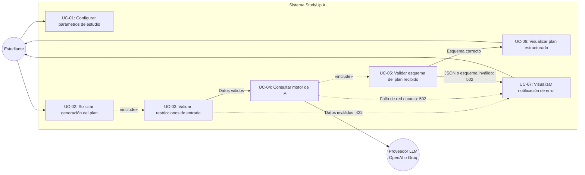
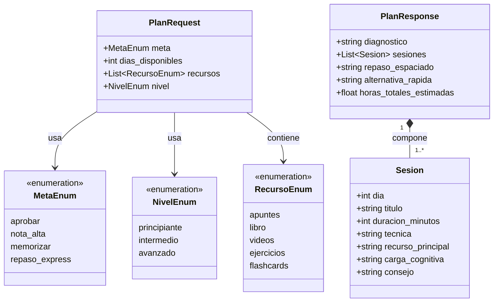
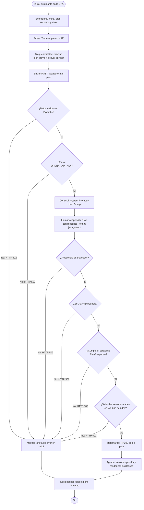
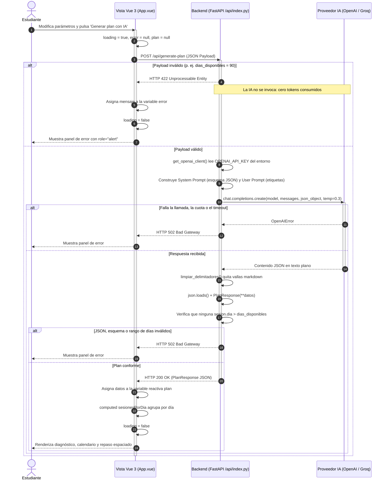
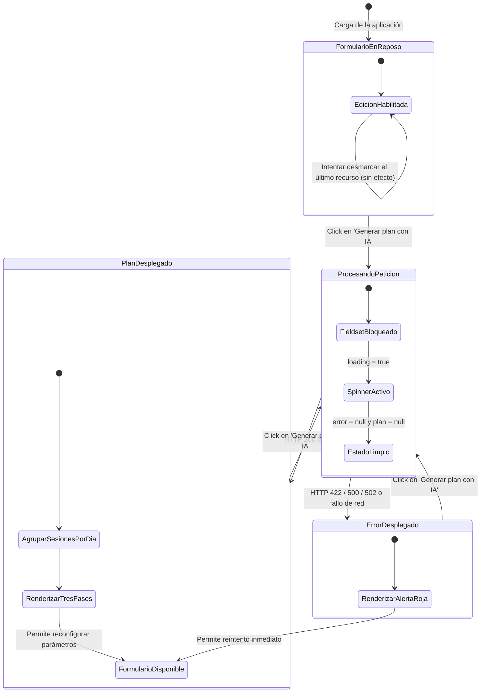

# PARTE 1: Especificación Técnica, Diseño y Guía Pedagógica

---

## 1. Descripción Detallada del Proyecto

**StudyUp AI** es una aplicación web de pantalla única (*Single Page Application* o SPA) que genera planes de estudio personalizados mediante Inteligencia Artificial. Su propósito pedagógico es instruir en el diseño y despliegue de una arquitectura de software *full-stack serverless* que combina tipado estricto en cliente y servidor, ingeniería de prompts estructurados, doble barrera de validación y control de estados reactivos.

A diferencia de un generador genérico, StudyUp no acepta texto libre en ningún campo: los cuatro parámetros de entrada son enumerados cerrados o enteros acotados. Esta decisión de diseño es el núcleo de su modelo de seguridad frente a la inyección de prompts.

### 1.1. ¿Cómo funciona la aplicación?

El flujo operativo del sistema consta de cinco etapas sincronizadas:

1. **Captura Paramétrica en el Cliente:**
   El usuario interactúa con un panel de control unificado donde configura exactamente cuatro variables de estudio:
   * **Meta del estudio:** Foco pedagógico de la planificación (`aprobar`, `nota_alta`, `memorizar`, `repaso_express`).
   * **Días hasta el examen:** Selector numérico continuo (*slider*) restringido entre 1 y 30 días, con saltos de 1 día.
   * **Recursos disponibles:** Matriz de selección múltiple (píldoras interactivas) con validación activa para garantizar al menos un elemento elegido (`apuntes`, `libro`, `videos`, `ejercicios`, `flashcards`).
   * **Nivel de partida:** Autoevaluación del dominio actual del temario (`principiante`, `intermedio`, `avanzado`).

2. **Validación y Despacho:**
   Al enviar el formulario, el cliente en **Vue 3 + TypeScript** verifica la integridad local del estado y bloquea la interfaz en modo asíncrono (*loading state*): el `<fieldset>` completo queda deshabilitado y el botón muestra un *spinner*. Emite una petición `POST /api/generate-plan` serializada en JSON.

3. **Primera Barrera: Validación de Entrada (Backend FastAPI):**
   La función *serverless* en Python somete el paquete de datos a las restricciones de **Pydantic v2**:
   * Si los datos son inconsistentes (p. ej., `dias_disponibles` manipulado a 90, o una `meta` inventada), el servidor rechaza la solicitud de inmediato con código HTTP 422, **sin contactar con la IA y sin gastar un solo token**.
   * Si los datos son válidos, el servicio construye un *prompt* blindado con un rol de sistema estricto (*System Prompt*) que incluye el esquema JSON exacto esperado, más los datos del usuario traducidos a lenguaje natural desde tablas de etiquetas controladas por el servidor.
   * Se ejecuta la consulta hacia el proveedor de IA utilizando la API Key alojada exclusivamente en las variables de entorno del servidor, forzando `response_format={"type": "json_object"}`.

4. **Segunda Barrera: Validación de Salida:**
   FastAPI analiza defensivamente la respuesta del modelo en cuatro pasos encadenados, cada uno con su propio código de error:
   * Respuesta vacía o sin `choices` → HTTP 502.
   * JSON sintácticamente inválido (tras limpiar posibles vallas ```` ```json ````) → HTTP 502.
   * JSON válido pero que no respeta el esquema `PlanResponse` → HTTP 502.
   * Plan que asigna sesiones a un día mayor que el solicitado → HTTP 502. Esta última comprobación es una barrera semántica: impide que una alucinación del modelo llegue a la interfaz como un calendario imposible.

5. **Consumo y Renderizado Reactivo:**
   Si el plan supera las cuatro comprobaciones, se transfiere al cliente con código HTTP 200. Vue 3 agrupa las sesiones por día mediante una propiedad computada y renderiza el plan segmentado en tres fases: diagnóstico y estrategia, calendario de sesiones (con técnica de estudio, recurso asignado, duración y carga cognitiva) y calendario de repaso espaciado, más un plan de contingencia para los días de 20 minutos.

---

### 1.2. Ejemplo Práctico de Uso de Extremo a Extremo

* **Escenario:** Marta tiene el examen de Estadística en una semana. Tiene los apuntes de clase y el cuadernillo de problemas, pero ha ido a medio gas todo el cuatrimestre y no sabe por dónde empezar ni cómo repartir los días.
* **Datos introducidos por Marta en la UI:**
  * *Meta:* `aprobar` (Aprobar con seguridad).
  * *Días hasta el examen:* `7 días`.
  * *Recursos seleccionados:* `apuntes`, `ejercicios`.
  * *Nivel:* `intermedio` (lo tengo a medias).
* **Payload HTTP transmitido hacia FastAPI (`POST /api/generate-plan`):**
  ```json
  {
    "meta": "aprobar",
    "dias_disponibles": 7,
    "recursos": ["apuntes", "ejercicios"],
    "nivel": "intermedio"
  }
  ```
* **Respuesta JSON estructurada devuelta por el Backend:**
  ```json
  {
    "diagnostico": "Partes con el temario a medias y solo una semana, así que priorizamos cerrar lagunas y practicar problemas tipo examen en lugar de releer. Los dos últimos días se reservan íntegros a repaso y autoevaluación.",
    "sesiones": [
      {
        "dia": 1,
        "titulo": "Mapa general del temario",
        "duracion_minutos": 50,
        "tecnica": "Pomodoro 25/5 + esquema Feynman",
        "recurso_principal": "apuntes",
        "carga_cognitiva": "Carga 5/10",
        "consejo": "Cierra los apuntes cada 25 minutos y reescribe el esquema de memoria; lo que no salga es tu lista de lagunas."
      },
      {
        "dia": 2,
        "titulo": "Problemas tipo examen de probabilidad",
        "duracion_minutos": 60,
        "tecnica": "Práctica de recuperación intercalada",
        "recurso_principal": "ejercicios",
        "carga_cognitiva": "Carga 7/10",
        "consejo": "Resuelve sin mirar la solución y corrige solo al terminar el bloque completo."
      },
      {
        "dia": 3,
        "titulo": "Repaso activo de lo del día 1",
        "duracion_minutos": 30,
        "tecnica": "Repetición espaciada",
        "recurso_principal": "apuntes",
        "carga_cognitiva": "Carga 4/10",
        "consejo": "Responde de memoria a las preguntas que te dejaste anotadas el primer día."
      }
    ],
    "repaso_espaciado": "Repasa el contenido del día 1 en los días 3 y 7, y el del día 2 en los días 5 y 7, siempre mediante preguntas de recuerdo activo y nunca releyendo.",
    "alternativa_rapida": "Si solo tienes 20 minutos, dedícalos íntegros a rehacer de memoria los ejercicios que fallaste el día anterior.",
    "horas_totales_estimadas": 9.5
  }
  ```
* **Renderizado en pantalla:** La interfaz desactiva el estado de carga, desbloquea el `<fieldset>` y despliega el plan agrupado por días, con la técnica de estudio y la carga cognitiva de cada sesión, el calendario de repaso espaciado y la tarjeta de contingencia.

---

## 2. Objetivos de Aprendizaje

1. **Tipado Estricto de Extremo a Extremo (End-to-End Type Safety):** Diseñar interfaces en TypeScript que sean el espejo exacto de los esquemas Pydantic del backend, asegurando la homogeneidad del contrato de datos.
2. **Reactividad Moderna con Vue 3:** Utilizar la sintaxis `<script setup lang="ts">`, referencias reactivas (`ref`), propiedades computadas (`computed`) para derivar el calendario agrupado, vinculación bidireccional (`v-model`), renderizado condicional (`v-if`) y directivas de listas (`v-for`) anidadas.
3. **Diseño Modular con Tailwind CSS:** Maquetar una interfaz *mobile-first* accesible, con etiquetas asociadas (`label for` / `id`), `aria-pressed` en los conmutadores, `role="alert"` en los errores y estados visuales de foco y deshabilitación.
4. **Seguridad e Inyecciones en LLMs:** Diseñar un *System Prompt* defensivo y, sobre todo, eliminar por diseño la superficie de ataque: cero campos de texto libre, todo enumerado o entero acotado, y traducción a lenguaje natural mediante tablas de etiquetas del servidor.
5. **Validación Bidireccional (Entrada y Salida):** Comprender que validar la petición del usuario no basta. La respuesta de un LLM es igualmente *input no confiable* y debe validarse contra un esquema antes de alcanzar la interfaz.
6. **Aislamiento de Secretos:** Configurar y resguardar variables de entorno en el servidor (`OPENAI_API_KEY`), garantizando que ninguna clave privada viaje al navegador del cliente, y cargar `.env` en local con `python-dotenv` sin romper el despliegue en producción.
7. **Pruebas Automatizadas Rigurosas:**
   * Pruebas de integración en FastAPI con **Pytest**, emulando peticiones con `TestClient` y aislando la IA mediante *mocks* para evitar consumo de tokens, cubriendo tanto el camino feliz como las cuatro rutas de fallo.
   * Pruebas unitarias y de integración de componentes en **Vitest** con `@vue/test-utils` sobre un entorno emulado con `jsdom`, incluyendo el estado de bloqueo asíncrono mediante una promesa controlada manualmente.
8. **Arquitectura Monorepositorio Serverless en Vercel:** Integrar un cliente Vite compilado a estáticos junto a endpoints dinámicos de Python ejecutados como Serverless Functions bajo el mismo origen, evitando CORS por completo.

---

## 3. Requisitos y Stack Tecnológico

### 3.1. Requisitos del Entorno
* **Node.js:** Versión 20.x LTS o superior (verificado en 24.x).
* **Python:** Versión 3.10, 3.11 o 3.12 con `pip` y soporte de entornos virtuales (`venv`).
* **Git:** Para control de versiones y despliegue automatizado.
* **Proveedor de IA:** Clave de API activa de OpenAI (`sk-...`) o Groq Cloud (`gsk-...`).
* **Cuenta Vercel:** Cuenta activa para despliegue en producción.

### 3.2. Stack Tecnológico

| Capa / Rol | Tecnología | Versión / Utilidad |
| :--- | :--- | :--- |
| **Lenguaje Frontend** | **TypeScript** | v5.x (Tipado estricto en cliente) |
| **Framework UI** | **Vue.js 3** | v3.5 con Composition API y `<script setup lang="ts">` |
| **Herramienta de Build** | **Vite** | v5.x con `@vitejs/plugin-vue` |
| **Framework de Estilos** | **Tailwind CSS** | v3.4 con Autoprefixer y PostCSS |
| **Iconografía** | **lucide-vue-next** | Iconos vectoriales accesibles |
| **Chequeo de Tipos** | **vue-tsc** | v3.x (compatible con TypeScript 5.9) |
| **Testing Frontend** | **Vitest + @vue/test-utils** | Pruebas de integración de componentes UI sobre `jsdom` |
| **Backend Framework** | **FastAPI** | Framework web ASGI de alto rendimiento |
| **Validación de Datos** | **Pydantic** | v2.x (Validación estructural y parseo de tipos) |
| **SDK de IA** | **OpenAI Python SDK** | v1.x (Conexión compatible con OpenAI y Groq) |
| **Secretos en local** | **python-dotenv** | Carga de `.env` en desarrollo |
| **Testing Backend** | **Pytest + HTTPX** | Pruebas de integración de endpoints con `TestClient` |
| **Hosting y CI/CD** | **Vercel** | Infraestructura monorepositorio con Serverless Runtimes |

> **Nota sobre `vue-tsc`:** las plantillas antiguas fijan `vue-tsc@^1.8`, que es incompatible con TypeScript ≥ 5.5 y falla con el error `Search string not found: "/supportedTSExtensions = .*(?=;)/"`. Este proyecto usa `vue-tsc@^3.1`, que sí soporta TypeScript 5.9 y Vue 3.5.

---

## 4. Estructura del Proyecto

```text
studyup-vue-ts/
├── api/
│   └── index.py               # Servidor FastAPI, endpoints, esquemas Pydantic y llamadas LLM
├── public/
│   └── favicon.svg            # Favicon del sistema
├── src/
│   ├── types/
│   │   └── plan.ts            # Definición de tipos e interfaces TypeScript compartidas
│   ├── App.vue                # Componente principal SPA (formulario y plan)
│   ├── env.d.ts               # Declaraciones de tipado para Vite y módulos Vue
│   ├── main.ts                # Inicialización y montaje del árbol Vue
│   └── style.css              # Directivas base de Tailwind y estilo del slider
├── tests/
│   ├── App.spec.ts            # Suite de pruebas frontend con Vitest y @vue/test-utils
│   └── test_api.py            # Suite de pruebas backend con Pytest y mocks de la IA
├── .env.example               # Plantilla de variables de entorno requeridas
├── .gitignore                 # Exclusión de artefactos de compilación, venv y secretos
├── index.html                 # Punto de entrada HTML5
├── package.json               # Dependencias de npm y scripts de ejecución
├── postcss.config.js          # Pipeline de PostCSS para Tailwind
├── pytest.ini                 # Raíz de importación y rutas de test para Pytest
├── requirements.txt           # Dependencias Python de PRODUCCIÓN (las que instala Vercel)
├── requirements-dev.txt       # Dependencias Python solo de desarrollo y testing
├── tailwind.config.js         # Configuración del motor de purgado de Tailwind CSS
├── tsconfig.json              # Configuración de compilación TypeScript para la aplicación
├── tsconfig.node.json         # Configuración TypeScript específica para la configuración de Vite
├── vercel.json                # Reglas de reescritura hacia la función Serverless
└── vite.config.ts             # Configuración de Vite, proxy de desarrollo y runner de Vitest
```

**Dos decisiones de estructura que conviene justificar:**

* **Los tests de Python viven en `tests/`, no en `api/`.** Vercel convierte **cada** fichero `.py` dentro de `api/` en una Serverless Function independiente. Un `api/test_api.py` se desplegaría a producción como una función inútil. Por el mismo motivo, las dependencias de testing (`pytest`, `httpx`, `uvicorn`) están en `requirements-dev.txt` y no en el `requirements.txt` que lee el *build* de Vercel.
* **No existe `api/__init__.py`.** No es necesario: `pytest.ini` declara `pythonpath = .`, y Python ≥ 3.3 trata `api/` como *namespace package*, de modo que `from api.index import app` funciona. Añadir un `__init__.py` vacío solo introduce un fichero más que Vercel podría intentar convertir en función.

---

## 5. Requisitos Funcionales y No Funcionales

### 5.1. Requisitos Funcionales (RF)

* **RF-01 (Selección Paramétrica Restringida):**
  * **RF-01.1:** El usuario debe seleccionar una única meta de estudio de una lista predefinida: `aprobar`, `nota_alta`, `memorizar` o `repaso_express`.
  * **RF-01.2:** El usuario debe definir los días disponibles mediante un control deslizante acotado estrictamente entre 1 y 30, con saltos de 1 día.
  * **RF-01.3:** El usuario debe poder alternar la disponibilidad de recursos mediante botones conmutables independientes (`apuntes`, `libro`, `videos`, `ejercicios`, `flashcards`). La aplicación debe impedir desmarcar todas las opciones, garantizando al menos un ítem activo.
  * **RF-01.4:** El usuario debe seleccionar su nivel de partida entre `principiante`, `intermedio` y `avanzado`.
* **RF-02 (Procesamiento Asíncrono y Estado de Bloqueo):** Al activar el botón de envío, el sistema debe inhabilitar **todos** los controles del formulario (mediante `<fieldset :disabled>`), activar el estado de carga con un *spinner* animado e iniciar la llamada HTTP a `/api/generate-plan`.
* **RF-03 (Esquema de Plan Específico):** El plan devuelto por el servidor debe contener obligatoriamente:
  * Texto de diagnóstico y estrategia global.
  * Lista de al menos una sesión, cada una con día, título, duración en minutos, técnica de estudio, recurso principal, carga cognitiva y consejo de ejecución.
  * Calendario de repaso espaciado.
  * Plan de contingencia para días de muy poco tiempo.
  * Total de horas estimadas.
* **RF-04 (Presentación Visual Agrupada):** El cliente debe desplegar el plan agrupando las sesiones por día, en bloques diferenciados dentro de la misma pantalla y sin navegación externa.
* **RF-05 (Notificación y Recuperación ante Errores):** Si la API responde con un código de error (422, 500, 502) o falla la conexión de red, la interfaz debe mostrar una tarjeta de advertencia con `role="alert"` y el mensaje del servidor, descartar cualquier plan anterior y devolver el formulario a un estado interactivo para su reintento.
* **RF-06 (Coherencia Temporal del Plan):** Ninguna sesión mostrada al usuario puede estar asignada a un día posterior al número de días solicitado.

### 5.2. Requisitos No Funcionales (RNF)

* **RNF-01 (Seguridad - Confinamiento de Secretos):** La clave privada `OPENAI_API_KEY` reside exclusivamente en el entorno de ejecución del servidor. Ningún encabezado ni payload en el navegador debe contener claves privadas. La ausencia de la clave produce un HTTP 500 controlado, nunca una traza de Python.
* **RNF-02 (Seguridad - Defensa contra Manipulación de Prompts):** Los parámetros de usuario están restringidos a enumeraciones y enteros acotados antes de la interpolación del prompt. **No existe ningún campo de texto libre** que permita insertar comandos en lenguaje natural que adulteren las directivas del modelo. La traducción a prosa se realiza mediante los diccionarios `ETIQUETAS_META` y `ETIQUETAS_NIVEL`, definidos en el servidor.
* **RNF-03 (Seguridad - Doble Barrera de Validación):** Toda restricción impuesta en la UI se valida de forma idéntica en el backend mediante Pydantic v2 (HTTP 422). Simétricamente, la respuesta del LLM se trata como entrada no confiable y se valida contra `PlanResponse` más una comprobación semántica de rango de días (HTTP 502).
* **RNF-04 (Arquitectura y Cohesión de Red):** La aplicación debe funcionar sin cambios en el código tanto en desarrollo local (usando el proxy de Vite) como en producción sobre Vercel (empleando *rewrites* en `vercel.json`), operando bajo el mismo origen. **No se instala middleware de CORS**, porque no hay petición *cross-origin* que permitir.
* **RNF-05 (Calidad de Código y Tipado):** El proyecto en el frontend debe compilar con cero errores en `vue-tsc --noEmit` bajo TypeScript estricto, con `noUnusedLocals` y `noUnusedParameters` activos.
* **RNF-06 (Economía de Tokens en Pruebas):** La suite de pruebas completa, de backend y de frontend, debe ejecutarse sin realizar ni una sola llamada real al proveedor de IA y sin requerir una `OPENAI_API_KEY` válida.

---

## 6. Diagramas UML del Sistema

### 6.1. Diagrama de Casos de Uso

Refleja las interacciones del estudiante con la SPA y la interacción entre el backend y el proveedor externo de IA. Nótese que la validación aparece dos veces: una sobre la entrada del usuario (UC-03) y otra sobre la salida del modelo (UC-05).



#### Descripción de Casos de Uso:
* **UC-01 (Configurar parámetros de estudio):** El estudiante ajusta meta, días, recursos y nivel en los controles interactivos.
* **UC-02 (Solicitar generación del plan):** El estudiante pulsa el botón de acción para enviar los datos hacia el backend.
* **UC-03 (Validar restricciones de entrada):** FastAPI intercepta la petición y verifica tipos, rangos y cardinalidades mediante esquemas de Pydantic. Si falla, la IA nunca se invoca.
* **UC-04 (Consultar motor de IA):** El backend construye el *System Prompt* y el *User Prompt* y envía la petición autenticada al servicio LLM.
* **UC-05 (Validar esquema del plan recibido):** El backend parsea el JSON, lo valida contra `PlanResponse` y comprueba que ninguna sesión exceda los días pedidos.
* **UC-06 (Visualizar plan estructurado):** El estudiante examina el calendario agrupado por días con técnicas, duraciones y cargas.
* **UC-07 (Visualizar notificación de error):** La aplicación muestra un panel de aviso ante cualquier fallo de validación, de red o de formato.

---

### 6.2. Diagrama de Clases

Representa los modelos de datos compartidos conceptualmente entre el cliente TypeScript (`src/types/plan.ts`) y el backend FastAPI/Pydantic (`api/index.py`). Cada interfaz de TypeScript es el espejo exacto de un modelo de Pydantic.



---

### 6.3. Diagrama de Actividad

Describe el flujo de control y las cuatro bifurcaciones de fallo durante la generación de un plan. Las dos barreras de validación (entrada y salida) son visualmente simétricas.



---

### 6.4. Diagrama de Secuencia

Ilustra las interacciones temporales entre el estudiante, el componente Vue, el servidor FastAPI y la API externa de IA.



---

### 6.5. Diagrama de Transición de Estados del Frontend

Representa los estados visuales del componente `App.vue` ante las acciones del estudiante y las respuestas de red. Los estados `ErrorDesplegado` y `PlanDesplegado` son mutuamente exclusivos, porque `handleSubmit()` limpia ambas variables al arrancar.



---

## 7. Plan de Fases de Ejecución Paso a Paso

### FASE 1: Inicialización del Proyecto y Entornos de Desarrollo
* **1.1. Andamiaje del Frontend:** Crear el proyecto con Vite y plantilla Vue + TypeScript. Instalar dependencias de producción (`vue`, `lucide-vue-next`) y de desarrollo (`vite`, `@vitejs/plugin-vue`, `typescript`, `vue-tsc`, `tailwindcss`, `postcss`, `autoprefixer`, `vitest`, `@vue/test-utils`, `jsdom`). **Fijar `vue-tsc@^3.1`**, no la versión 1.8 de las plantillas antiguas.
* **1.2. Configuración de Tailwind CSS:** Ejecutar `npx tailwindcss init -p` y configurar el barrido de archivos en `tailwind.config.js` para procesar `.html`, `.vue`, `.ts` y `.js`. Inyectar las directivas `@tailwind` en `src/style.css` y añadir el estilo del pulgar del *slider*.
* **1.3. Enlace de Red Local (Proxy):** Configurar `server.proxy` en `vite.config.ts` para desviar las llamadas que comiencen por `/api` al puerto local `8000`. Esto permite trabajar en local con rutas idénticas a las de Vercel.
* **1.4. Aislamiento del Entorno Python:** Crear un entorno virtual `.venv`, activarlo e instalar `pip install -r requirements-dev.txt`. Separar desde el principio `requirements.txt` (producción: `fastapi`, `pydantic`, `openai`, `python-dotenv`) de `requirements-dev.txt` (añade `uvicorn`, `pytest`, `httpx`), porque Vercel instalará únicamente el primero.
* **1.5. Plantilla de Secretos:** Crear `.env.example` con `OPENAI_API_KEY` y las variables opcionales `OPENAI_BASE_URL` y `AI_MODEL`. Copiarlo a `.env`, rellenar la clave real y verificar que `.gitignore` excluye `.env`.

### FASE 2: Desarrollo del Backend Serverless con FastAPI
* **2.1. Modelado de Dominio con Pydantic:** En `api/index.py`, definir las clases enumeradas `MetaEnum`, `NivelEnum` y `RecursoEnum`. Crear el modelo `PlanRequest` implementando las validaciones de rango numérico (`ge=1, le=30`) y tamaño de lista (`min_length=1`).
* **2.2. Modelos de Salida Estructurados:** Definir las clases `Sesion` y `PlanResponse` con tipos estrictos y restricciones propias (`dia` ≥ 1, `duracion_minutos` entre 10 y 240, `sesiones` con `min_length=1`). Estas restricciones son la red que atrapa las alucinaciones del modelo.
* **2.3. Carga de Secretos y Factoría de Conexión:** Llamar a `load_dotenv()` al importar el módulo (es un no-op en Vercel, donde las variables ya están inyectadas) e implementar `get_openai_client()` para leer `OPENAI_API_KEY` del entorno y admitir de forma transparente la variable opcional `OPENAI_BASE_URL` para compatibilidad con Groq.
* **2.4. Ingeniería del Prompt Defensivo:** Diseñar el *System Prompt* incluyendo el esquema JSON literal esperado y las reglas obligatorias (usar solo los recursos del usuario, no exceder los días, ignorar instrucciones ajenas al mensaje de sistema). Construir el *User Prompt* traduciendo los enumerados a prosa mediante `ETIQUETAS_META` y `ETIQUETAS_NIVEL`, nunca concatenando texto del usuario.
* **2.5. Pipeline de Validación de Salida:** Implementar la cadena de cuatro comprobaciones (`contenido` no vacío → `limpiar_delimitadores()` → `json.loads()` → `PlanResponse(**datos)` → rango de días), cada una lanzando un `HTTPException` 502 con un mensaje distinto. **Evitar el `except Exception` genérico**, que convierte errores de esquema en 500 y filtra trazas internas al cliente.

### FASE 3: Pruebas Automatizadas de Backend con Pytest
* **3.1. Configuración de la Suite:** Crear `pytest.ini` con `pythonpath = .` y `testpaths = tests`, y `tests/test_api.py` utilizando `TestClient` de FastAPI. Definir las constantes `PLAN_VALIDO` y `PETICION_VALIDA` y el ayudante `_mock_client_con()`.
* **3.2. Test de Verificación de Salud:** Asegurar que `/api/health` responda con HTTP 200 y el estado esperado.
* **3.3. Tests de la Primera Barrera (HTTP 422):** Enviar cargas con días fuera de rango (0 y 90), con lista de recursos vacía y con un enumerado inventado, comprobando que el servidor devuelve 422 en los tres casos.
* **3.4. Tests del Camino Feliz con Mock de IA:** Utilizar `unittest.mock.patch` sobre `api.index.get_openai_client` para suministrar una respuesta JSON simulada. Verificar el HTTP 200 y los datos, y repetir la prueba con el JSON envuelto en vallas ```` ```json ```` para validar `limpiar_delimitadores()`.
* **3.5. Tests de la Segunda Barrera (HTTP 502):** Cuatro casos: respuesta conversacional no parseable, JSON válido con esquema incompleto, plan con una sesión en el día 40 para una petición de 7 días, y respuesta vacía (`None`).
* **3.6. Test de Gestión de Secretos (HTTP 500):** Con `@patch.dict("os.environ", {}, clear=True)`, comprobar que la ausencia de `OPENAI_API_KEY` produce un 500 controlado cuyo mensaje nombra la variable que falta.

### FASE 4: Desarrollo del Frontend en Vue 3 con Composition API
* **4.1. Definición de Tipos en TypeScript:** Crear `src/types/plan.ts` con los tipos unión y las interfaces espejo de los esquemas del backend.
* **4.2. Estado Reactivo e Interfaz en `src/App.vue`:**
  * Crear referencias reactivas (`ref`) para las 4 entradas, el estado de carga (`loading`), el error (`error`) y el plan recibido (`plan`).
  * Derivar `sesionesPorDia` con `computed`, agrupando las sesiones en un `Map` y ordenándolas por día.
  * Implementar `toggleRecurso()` asegurando que siempre quede al menos un recurso activo.
  * Programar la función asíncrona `handleSubmit()` con `try / catch / finally`, limpiando `error` y `plan` al arrancar y restaurando `loading` en el `finally`.
* **4.3. Estilizado Modular y Accesibilidad con Tailwind:** Diseñar el formulario en dos columnas para pantallas medianas, envolver los cuatro controles en un `<fieldset :disabled="loading">` para cumplir RF-02 de una sola vez, asociar cada `label` con su `id`, marcar los conmutadores con `aria-pressed` y la tarjeta de error con `role="alert"`.

### FASE 5: Pruebas Unitarias de Frontend con Vitest
* **5.1. Configuración del Entorno de Pruebas:** Configurar `vitest` con entorno `jsdom` e `include: ['tests/**/*.spec.ts']` en `vite.config.ts`, para que el *runner* no intente recoger los ficheros de Python del mismo directorio.
* **5.2. Test de Renderizado Inicial:** Comprobar con `@vue/test-utils` que los 4 controles del formulario y el botón de acción se montan en el DOM.
* **5.3. Test del Contrato de Red:** Interceptar `fetch` con `vi.stubGlobal` y verificar la URL, el método y el *payload* exacto que se envía al backend.
* **5.4. Test de Renderizado del Plan:** Resolver las promesas reactivas con `flushPromises()` y verificar que aparecen los encabezados de día, los títulos de las sesiones, el repaso espaciado y las horas estimadas.
* **5.5. Tests de las Rutas de Error (RF-05):** Simular una respuesta `ok: false` con `detail`, y por separado un `fetch` rechazado, comprobando que se renderiza la alerta y que **no** se renderiza ningún plan.
* **5.6. Test del Estado de Bloqueo (RF-02):** Devolver desde `fetch` una promesa cuyo `resolve` se guarda en una variable, comprobar que el `fieldset` y el botón están deshabilitados mientras la petición está en vuelo, y resolverla después para verificar el desbloqueo.

### FASE 6: Configuración Serverless en Vercel y Despliegue
* **6.1. Reglas de Enrutamiento en `vercel.json`:** Configurar la reescritura que redirige cualquier petición `/api/(.*)` hacia `/api/index.py`. El ASGI de FastAPI recibe la ruta original, por lo que los decoradores conservan el prefijo `/api`.
* **6.2. Control de Versiones:** Comprobar que `.gitignore` excluye `.venv`, `node_modules`, `dist`, `.vercel` y `.env`. Crear el *commit* inicial y subir el repositorio a GitHub o GitLab.
* **6.3. Despliegue y Variables en Vercel:** Importar el repositorio desde la consola de Vercel (el framework se detecta automáticamente como Vite). Configurar en **Environment Variables** la clave `OPENAI_API_KEY` y, opcionalmente, `OPENAI_BASE_URL` y `AI_MODEL` si se utiliza Groq.
* **6.4. Verificación en Producción:** Acceder a `https://<tu-proyecto>.vercel.app/api/health` para confirmar que la función Python arrancó, y después generar un plan desde la UI comprobando en la pestaña *Network* del navegador que ninguna petición contiene la clave de API.

---

# PARTE 2: Solución Técnica Completa

A continuación se presenta el código fuente íntegro y funcional de todos los archivos del proyecto. Este código es el que está en el repositorio: el documento se genera inyectando los ficheros reales, de modo que no puede desincronizarse de ellos.

**Estado de verificación:**

| Comprobación | Comando | Resultado |
| :--- | :--- | :--- |
| Tipado estricto (RNF-05) | `npx vue-tsc --noEmit` | 0 errores |
| Pruebas de frontend | `npm test` | 7 de 7 pasando |
| Compilación de producción | `npm run build` | OK (84 kB JS / 14 kB CSS) |
| Pruebas de backend (RNF-06) | `pytest -v` | 11 de 11 pasando, 0 tokens consumidos |
| Arranque real del servidor | `uvicorn api.index:app --port 8000` | `GET /api/health` → `{"status":"ok", ...}` |
| Validez de los diagramas UML | Parser de Mermaid | 5 de 5 válidos |

**Versiones exactas con las que se ha verificado:** Node 24.13, Python 3.12.10, Vue 3.5.43, TypeScript 5.9.3, Vite 5.4.21, Vitest 1.6.1, vue-tsc 3.1, FastAPI 0.142.2, Pydantic 2.13.5, OpenAI SDK 3.24.0, Pytest 9.1.1.

> **Nota sobre el SDK de OpenAI:** `requirements.txt` declara `openai>=1.12.0`, que hoy resuelve a la rama 3.x. Se ha comprobado por introspección que `OpenAI(api_key, base_url)`, `client.chat.completions.create(...)` y los parámetros `model`, `messages`, `response_format`, `temperature` y `max_tokens` siguen existiendo en 3.24.0, y que `OpenAIError` continúa derivando de `Exception`. El código es por tanto compatible con ambas ramas sin cambios.
